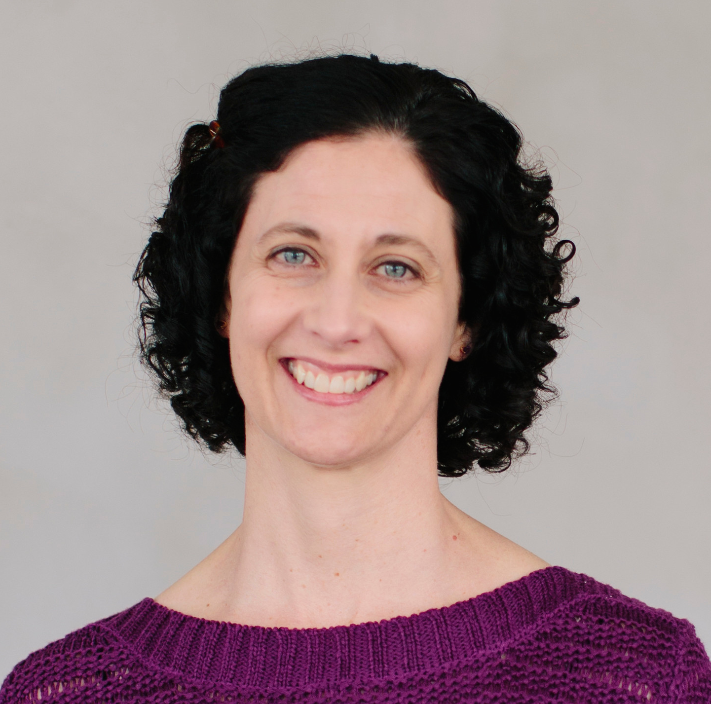

# Mentors

The following mentors have graciously agreed to participate in the CES mentoring program during the 2021-22 academic year. They represent a wealth of experience and wide variety of industry expertise covering the full spectrum of the CS field.

  <!-- Begin Mentor -->
    

      

        

          

            
          

        

        

          <strong>Sami Rollins</strong> 
          <i class="fa-fw fas fa-calendar-alt "></i>
          Tuesdays, 5:15pm &dash; 6:15pm
           

          <i class="fa-fw fas fa-calendar-alt "></i>
          Wednesdays, 1:30pm &ndash; 3:00pm
           

          <i class="fa-fw fas fa-calendar-alt "></i>
          Thursdays, 9:15am &dash; 9:45am
           

          <i class="fa-fw fas fa-signal-stream "></i>
          Zoom: <a href="https://usfca.zoom.us/j/81328665253">813 2866 5253</a>
           

          <i class="fa-fw fas fa-globe "></i>
          <a href="//srollins.cs.usfca.edu">srollins.cs.usfca.edu</a>
        

      

    

  <!-- End Mentor -->

  <!-- Begin Mentor -->
    

      

        

          

            
          

        

        

          <strong>Sami Rollins</strong> 
          <i class="fa-fw fas fa-calendar-alt "></i>
          Tuesdays, 5:15pm &dash; 6:15pm
           

          <i class="fa-fw fas fa-calendar-alt "></i>
          Wednesdays, 1:30pm &ndash; 3:00pm
           

          <i class="fa-fw fas fa-calendar-alt "></i>
          Thursdays, 9:15am &dash; 9:45am
           

          <i class="fa-fw fas fa-signal-stream "></i>
          Zoom: <a href="https://usfca.zoom.us/j/81328665253">813 2866 5253</a>
           

          <i class="fa-fw fas fa-globe "></i>
          <a href="//srollins.cs.usfca.edu">srollins.cs.usfca.edu</a>
        

      

    

  <!-- End Mentor -->

  <!-- Begin Mentor -->
    

      

        

          

            
          

        

        

          <strong>Sami Rollins</strong> 
          <i class="fa-fw fas fa-calendar-alt "></i>
          Tuesdays, 5:15pm &dash; 6:15pm
           

          <i class="fa-fw fas fa-calendar-alt "></i>
          Wednesdays, 1:30pm &ndash; 3:00pm
           

          <i class="fa-fw fas fa-calendar-alt "></i>
          Thursdays, 9:15am &dash; 9:45am
           

          <i class="fa-fw fas fa-signal-stream "></i>
          Zoom: <a href="https://usfca.zoom.us/j/81328665253">813 2866 5253</a>
           

          <i class="fa-fw fas fa-globe "></i>
          <a href="//srollins.cs.usfca.edu">srollins.cs.usfca.edu</a>
        

      

    

  <!-- End Mentor -->

  <!-- Begin Mentor -->
    

      

        

          

            
          

        

        

          <strong>Sami Rollins</strong> 
          <i class="fa-fw fas fa-calendar-alt "></i>
          Tuesdays, 5:15pm &dash; 6:15pm
           

          <i class="fa-fw fas fa-calendar-alt "></i>
          Wednesdays, 1:30pm &ndash; 3:00pm
           

          <i class="fa-fw fas fa-calendar-alt "></i>
          Thursdays, 9:15am &dash; 9:45am
           

          <i class="fa-fw fas fa-signal-stream "></i>
          Zoom: <a href="https://usfca.zoom.us/j/81328665253">813 2866 5253</a>
           

          <i class="fa-fw fas fa-globe "></i>
          <a href="//srollins.cs.usfca.edu">srollins.cs.usfca.edu</a>
        

      

    

  <!-- End Mentor -->

  <!-- Begin Mentor -->
    

      

        

          

            
          

        

        

          <strong>Sami Rollins</strong> 
          <i class="fa-fw fas fa-calendar-alt "></i>
          Tuesdays, 5:15pm &dash; 6:15pm
           

          <i class="fa-fw fas fa-calendar-alt "></i>
          Wednesdays, 1:30pm &ndash; 3:00pm
           

          <i class="fa-fw fas fa-calendar-alt "></i>
          Thursdays, 9:15am &dash; 9:45am
           

          <i class="fa-fw fas fa-signal-stream "></i>
          Zoom: <a href="https://usfca.zoom.us/j/81328665253">813 2866 5253</a>
           

          <i class="fa-fw fas fa-globe "></i>
          <a href="//srollins.cs.usfca.edu">srollins.cs.usfca.edu</a>
        

      

    

  <!-- End Mentor -->

