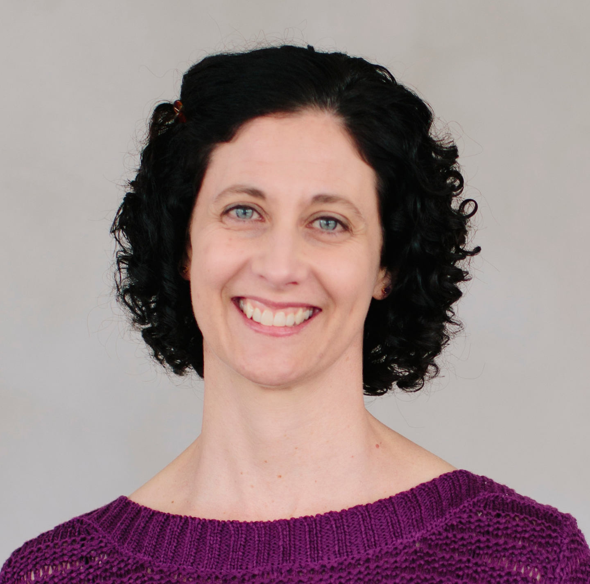
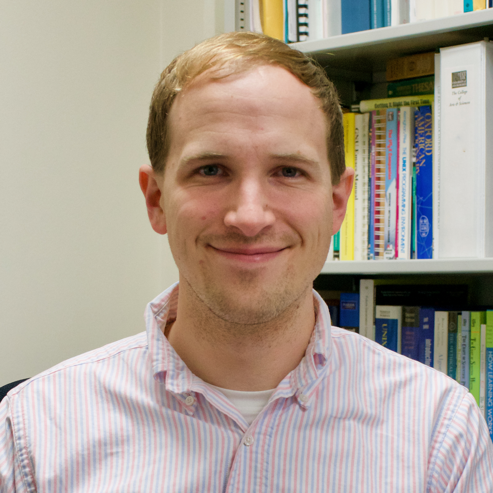

# CS 386: Career Mentoring and Professional Identity Development
{: .title }

#### Fall 2021 &bull; CS 386-01 &bull; 2 Credits
{: .subtitle .has-text-weight-light }

This course gives students the opportunity to engage with alumni mentors from industry and develop their identities as computing professionals.

Computer science is a broad, diverse field. No matter your background, your hobbies, or your working style, computer science has a place for you. Finding that place and navigating the field may seem daunting at times, but we aim to build a support structure through classmates, peers, teachers, and mentors to make the journey easier.

## Course Information
{: .page-header }

### Lecture Sections

This course meets once a week as follows:

  

    <strong>CS 386-01 (CRN 42484)</strong> 
    <strong>Modality:</strong> Hybrid 
    <i class="fa-fw fas fa-calendar-alt"></i>
    Wednesdays in <strong>HR 435</strong> 
    <i class="fa-fw fas fa-clock"></i>
    4:45 &ndash; 6:25pm 
    <i class="fa-fw fas fa-signal-stream"></i>
    Zoom: <a href="{{ site.zoom }}">874 8284 8820</a>
  

Some activities may occur outside of the scheduled class time. These will be announced on [Campuswire]({{ page.campuswire }}).

Since this course will be taught with in the hybrid modality, some activities will conducted over Zoom.  See the [Getting Started With Zoom](getting-started-with-zoom.html) guide for how to download, install, login, and properly use Zoom.

### Instructors

The course instructor and office hours will be as follows:

  

    

      <!-- nested columns for profile photo -->
      

        

          

            
          

        

        

          <strong>Sami Rollins</strong> 
          <i class="fa-fw fas fa-calendar-alt "></i>
          Thursdays, 2:45pm &ndash; 4:15pm
           

          <i class="fa-fw fas fa-calendar-alt "></i>
          Fridays, 11:00pm &ndash; 12:30pm
           

          <i class="fa-fw fas fa-signal-stream "></i>
          Zoom: <a href="https://usfca.zoom.us/j/98397885780">983 9788 5780</a>
           

          <i class="fa-fw fas fa-globe "></i>
          <a href="//srollins.cs.usfca.edu">srollins.cs.usfca.edu</a>
        

      

      <!-- end nested columns -->
    

  

  

    

      <!-- nested columns for profile photo -->
      

        

          

            
          

        

        

        <strong>Matthew Malensek</strong> 
        <i class="fa-fw fas fa-calendar-alt "></i>
        Thursdays, 2:45pm &ndash; 4:15pm
         

        <i class="fa-fw fas fa-calendar-alt "></i>
        Fridays, 11:00pm &ndash; 12:30pm
         

        <i class="fa-fw fas fa-signal-stream "></i>
        Zoom: <a href="https://usfca.zoom.us/j/97257977977">972 5797 7977</a>
         

        <i class="fa-fw fas fa-globe "></i>
        <a href="http://www.cs.usfca.edu/~mmalensek/">cs.usfca.edu/~mmalensek</a>
        

      

      <!-- end nested columns -->
    

  

### Prerequisites

Requires instructor approval. Must be a third-year CS major in the CES program.

### Required Materials

There are no required textbooks for this class.

Students will be required to use various software and websites, including Zoom, Canvas,  and Campuswire. Everything is free to use for enrolled students, will be linked from the course website, and class time will be dedicated to making sure everyone has appropriate access.

### Important Dates

Below are important dates relevant to this class:

| Date  | Description |
|:------|:------------|
| 08/24 | Fall 2021 classes begin. |
| 08/25 | First CS 386-01 lecture. |
| 08/30 | Last day to add classes |
| 09/06  | Labor Day Holiday (No classes) |
| 09/10 | Census date; last day to drop without a "W" appearing on transcript. |
| 10/18--10/19 | Fall Break (No Classes) |
| 11/05 | Last day to drop courses or withdraw |
| 11/25--11/26 | Thanksgiving recess |
| 12/08 | Last day of classes |
| 12/09 | CS Night |
{: class="table dates is-hoverable" style="width: auto;" }

See the [official academic calendar](https://myusf.usfca.edu/registration/academic-calendar) for other important dates.

We will not have a final exam in this class. Students must instead attend CS Night on Thursday December 9th.
{: .notification }

## Learning and Assessment
{: .page-header }

This section discusses what the students can expect to learn in this course and how the learning outcomes for this course will be assessed.

### Learning Outcomes

Students who complete the Career Mentoring and Professional Identity Development course will be able to:

* Describe their career goals and desired job characteristics.
* Explain the concepts of identity and intersectionality.
* Identify the personal strengths and values that support their career goals.
* Identify ways in which they are or could be recognized as computer scientists by others.
* Identify resources to aid in the development of the knowledge, skills, and abilities necessary to meet their career goals.

### Course Topics

The course will provide students the opportunity to meet with alumni mentors from industry and will cover several aspects of professional identity development. Topics include defining and building identity, CS disciplines and knowledge areas, and imposterism. Some of the questions we'll explore include the following:

* What does the field of computing include? How do the subfields of computing fit together?
* Who are computing professionals? What are their roles, and what do they do in their work?
* How does one learn to speak the language of a computer scientist?
* How does one develop the skills to practice the computing profession?

We will discuss these topics as a class as well as with alumni mentors.

### Grading Breakdown

The course requirements are broken into several categories. Students must earn above a 60% in each category to pass the course.

**If one or more categories fall below 60%, then an “F” letter grade is automatically assigned regardless of the percentage score.**

As long as all categories remain above a 60%, the final grade is determined by the following breakdown:

| Percent | Category        |
|--------:|:----------------|
|     20% | Class Attendance |
|     20% | Participation |
|     20% | Mentor Meetings |
|     20% | Community Engagement |
|     20% | Class Presentation |
{: class="table is-hoverable" style="width: auto;"}

Additional details on each category can be found below.

##### Class Attendance

Students are expected to attend class on-time and participate during in-class exercises. Students must be present for at least 90% of the class time to earn attendance credit.

Students must attend at least 60% of all classes to pass this course.

##### Participation Assignments

Students must complete weekly pass/fail participation assignments throughout the semester. Example assignments include writing reflections, responding to discussion prompts, providing presentation feedback, and responding to surveys and in-class polls.

##### Mentor Meetings

Students will be paired with a USF alumni mentor and will schedule a check-in with the mentor at least once a month during the 2021-22 academic year. Suggested discussion topics will be provided, but the student and mentor are encouraged to drive the conversations wherever they see fit. Topics could include strategies for finding an internship, imposterism, interviewing tips, day-to-day experiences as a software engineer/product manager/tech lead/etc., or even technical topics.

Students will receive credit for:
* Scheduling and preparing for a meeting each month
* Attending the meeting
* Reflections and discussions after the meeting

##### Community Engagement

Students must attend community engagement activities outside of class. Participation in these activities makes up the majority of the out-of-class work required for this class.

This includes participating in at least one event offered by the CS department (other than CS Night), at least one event offered by the University, and at least one event offered by the local SF Bay Area or technical communities.

This also involves participating in the annual CS Night celebration at the end of the semester. Participation in this event replaces the final exam for this course.

##### Class Presentation

To help everyone get more comfortable at presenting technical topics, students will prepare a 20 minute presentation (including time for discussion). While the topic of the presentation must be technical in nature, students will be given freedom to select the topic based on their own interests. A few possibilities:
1. Present an article about a tech-related topic (e.g., algorithmic bias)
1. Present a technical tool (e.g., a new programming language, cloud service, etc.)
1. Present a helpful resource (programming resources, interview tips and prep, podcasts, etc.)

### Grading Scale

Students must earn above a 60% in each category to pass the course.

**If one or more categories fall below 60%, then an “F” letter grade is automatically assigned regardless of the percentage score.**

As long as all grade categories remain above a 60%, the final grade is determined by the following letter grade and GPA scale:

|          | Letter |        | GPA |
|---------:|:-------|:-------|:---:|
| 97% &le; | A+     | < 100% | 4.0 |
| 94% &le; | A      | < 97%  | 4.0 |
| 90% &le; | A--    | < 94%  | 3.7 |
| 87% &le; | B+     | < 90%  | 3.3 |
| 84% &le; | B      | < 87%  | 3.0 |
| 80% &le; | B--    | < 84%  | 2.7 |
| 77% &le; | C+     | < 70%  | 2.3 |
| 74% &le; | C      | < 77%  | 2.0 |
| 70% &le; | C--    | < 74%  | 1.7 |
| 67% &le; | D+     | < 70%  | 1.3 |
| 64% &le; | D      | < 67%  | 1.0 |
| 60% &le; | D--    | < 64%  | 0.7 |
|  0% &le; | F      | < 60%  | 0.0 |
{: class="table gpa" style="width: auto;"}

See the [Undergraduate Student Regulations](https://catalog.usfca.edu/content.php?catoid=22&navoid=3097) for more about letter grades and GPA for undergraduate students.

## Course Policies
{: .page-header }

This section includes miscellaneous policies specific to this course, including communication, attendance, credit hours, cheating, and more. These policies are in addition to the standard USF policies included later.

### Student Conduct

Students are required to adhere to the University's [Student Code of Conduct](https://myusf.usfca.edu/fogcutter/student-conduct). In short, students are expected to treat each other with respect at all times.

### Attendance Policy

See the [Class Attendance](#class-attendance) requirements above. Students must be present for at least 90% of the class time to earn attendance credit.

Students must attend at least 60% of all classes to pass this course. See the [Grading Scale](#grading-scale) section for details.

### Late Policy

By default, late submissions are not accepted. However, students may request an exception to this policy for excused absences/activities.

### Cheating Policy

All students are expected to know and adhere to the University’s Honor Code (see the [Academic Integrity](#academic-integrity) section below). In short, students must never misrepresent their work.  Flagrant or repeat violations of the honor code will result in an F in the course, a report to the Academic Integrity Committee (AIC), and a report to the Dean.

### Credit Hour Policy

The official [USF Credit Hour Policy](https://myusf.usfca.edu/sites/default/files/users/kmclemore/USF%20Credit%20Hour%20Policy%2020180726.pdf) states:
  > "One unit of credit in lecture, seminar, and discussion work should approximate one hour of direct faculty instruction and a minimum of two hours of out-of-class student work per week through one 15-week semester."

Students should expect to spend approximately 1 hour on out-of-class work every week, with some weeks requiring more out-of-class time. See the [Community Engagement](#community-engagement) requirements for out-of-class expectations over the semester.

## University Policies
{: .page-header }

This section includes [standard statements](https://myusf.usfca.edu/arts-sciences/faculty-resources/curriculum/syllabi/policies-legal-declarations) on University policies and resources.

### Students with Disabilities

The University of San Francisco is committed to providing equal access to students with disabilities. If you are a student with a disability, or if you think you may have a disability, please contact [USF Student Disability Services (SDS)](https://myusf.usfca.edu/sds) at [sds@usfca.edu](mailto:sds@usfca.edu) or call (415) 422-2613 to speak with a disability specialist. All communication with SDS is private and confidential. If you are eligible for accommodations, please request that your accommodation letter be sent to me as soon as possible, as accommodations are not retroactive. Once I have been notified by SDS of your accommodations we can discuss your accommodations and ensure your access to this class or clinical setting.

### Behavioral Expectations

All students are expected to behave in accordance with the [Student Conduct Code](https://myusf.usfca.edu/fogcutter) and other University policies.

### Academic Integrity

USF upholds the standards of honesty and integrity from all members of the academic community. All students are expected to know and adhere to the University's [Honor Code](https://myusf.usfca.edu/academic-integrity/).

### Communication

All course communications, like all other USF communications, will be sent to your USF official email address. You are therefore strongly encouraged to monitor that email account.

### Counseling and Psychological Services (CAPS)

CAPS provides confidential, [free counseling](https://myusf.usfca.edu/student-health-safety/caps) to student members of our community.

### Confidentiality, Mandatory Reporting, and Sexual Assault

For information and resources regarding sexual misconduct or assault visit the [Title IX](https://myusf.usfca.edu/TITLE-IX) coordinator or [USF's Callisto website](http://usfca.callistocampus.org/).
