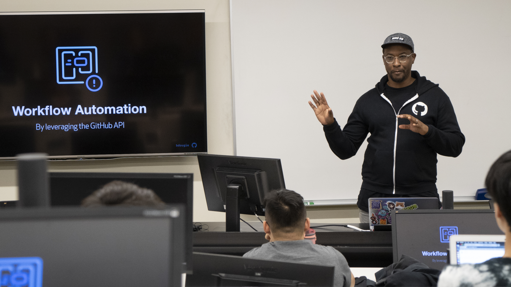
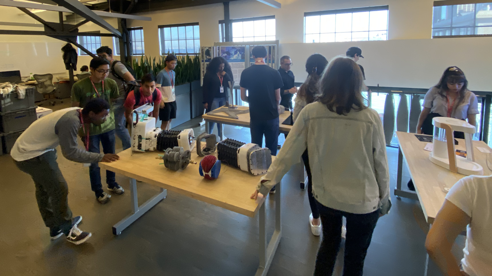


<link rel="stylesheet" href="https://cdn.jsdelivr.net/npm/bulma-carousel@4.0.4/dist/css/bulma-carousel.min.css">

  

    

      

        
      

      

        Students at the <a href="https://www.autodesk.com/technology-centers/san-francisco">AutoDesk Technology Center</a> field trip as part of the <a href="https://scholars.cs.usfca.edu/cs186-fall2019/">Community Engaged CS</a> course in 2019.
      

    

  

  

    

      

        
      

      

        Students at the <a href="https://www.lyft.com/careers">Lyft</a> field trip as part of the <a href="https://scholars.cs.usfca.edu/cs186-fall2019/">Community Engaged CS</a> course in 2019.
      

    

  

  

    

      

        
      

      

        <a href="https://twitter.com/bdougieYO">Brian Douglas</a>, Developer Advocate at Github.com, speaking to students as part of the <a href="https://scholars.cs.usfca.edu/cs186-fall2019/">Community Engaged CS</a> course in 2019.
      

    

  

  

    

      

        
      

      

        Students at the <a href="https://www.autodesk.com/technology-centers/san-francisco">AutoDesk Technology Center</a> field trip as part of the <a href="https://scholars.cs.usfca.edu/cs186-fall2019/">Community Engaged CS</a> course in 2019.
      

    

  
  



  <button class="delete"></button>
  
All instruction for Fall 2020 will be conducted remotely via Zoom. See the <a href="https://myusf.usfca.edu/covid">USF Remote</a> page for more resources related to the ongoing COVID-19 pandemic.

{{ site.description }}

Classes are livestreamed on **Fridays** from **1:00pm&ndash;2:45pm** via [Zoom]({{ site.zoom }}).

[Getting Started Guide]({{ "/guides/getting-started.html" | relative_url }}){: .button .is-primary } &nbsp; [Join Livestream]({{ site.zoom }}){: .button .is-primary}

## Upcoming Schedule

{%- assign today_date = 'now' | date: '%Y-%m-%d' -%}
{%- assign today = today_date | date: '%s'| abs -%}
{%- assign beg_date = '2020-08-18' | date: '%s' | abs -%}



  

  
    
      {%- assign as_seconds = week.date | date: '%s' | abs -%}
      
        
      
    
    
  

  









