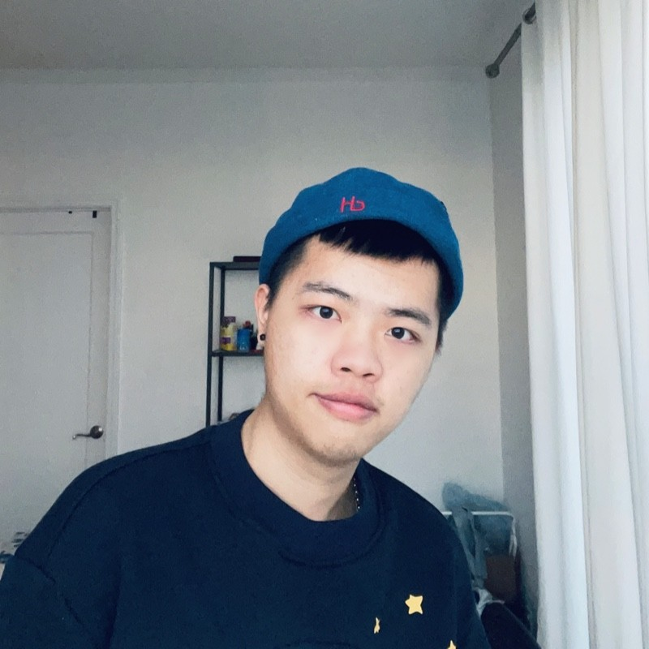
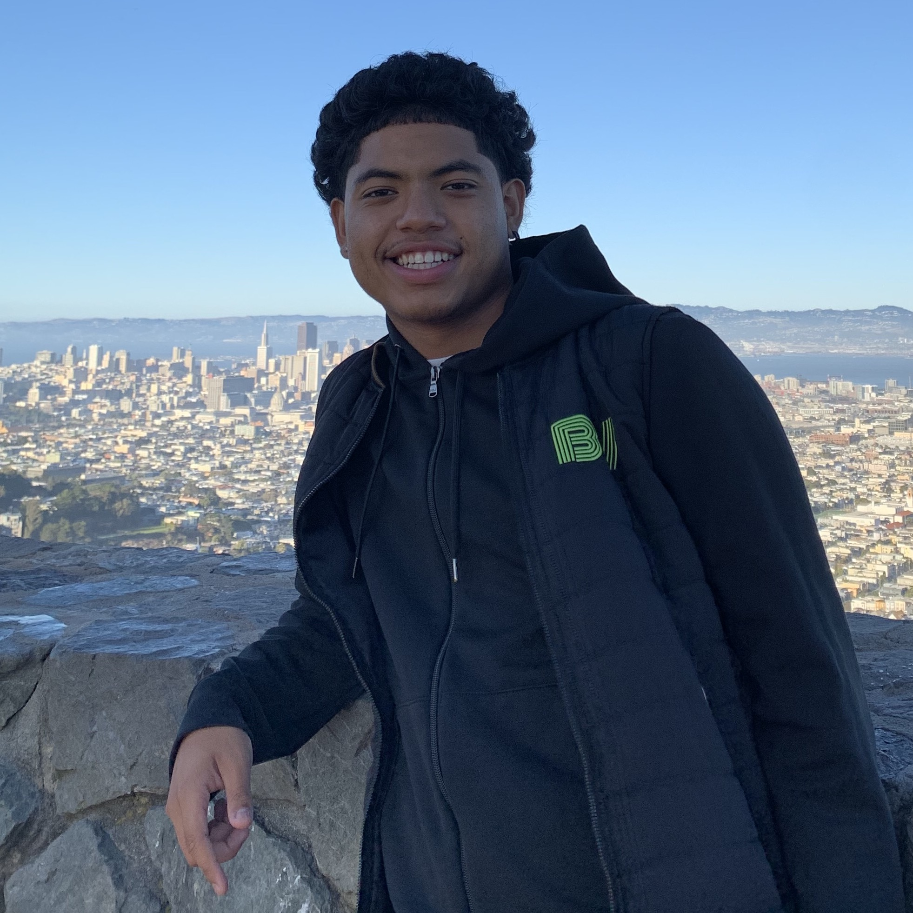
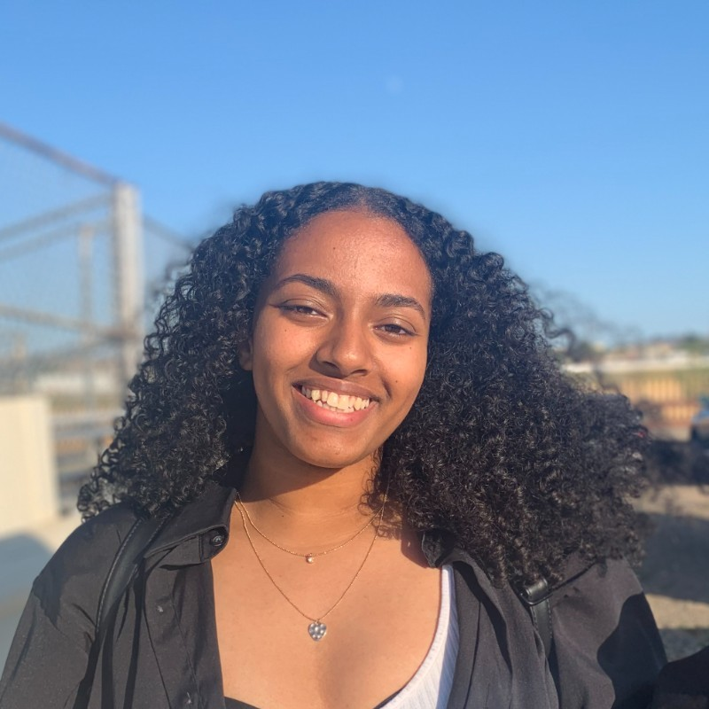

# Students

The following students are participating in CS 386. You'll find links to their portfolios below.

  <!-- Begin Student -->
  

    

      

        

          
        

      

      

        <strong>Kenny Dong</strong> 
        Portfolio: (coming soon!) 
        <a href="https://www.linkedin.com/in/dongkenny/">LinkedIn</a>
      

    

  

  <!-- End Student -->

  <!-- Begin Student -->
  

    

      

        

          
        

      

      

        <strong>Jose Chumbe Davila</strong> 
        Portfolio: (coming soon!) 
        <a href="https://www.linkedin.com/in/josechumbedavila/">LinkedIn</a>
      

    

  

  <!-- End Student -->

  <!-- Begin Student -->
  

    

      

        

          
        

      

      

        <strong>Sofia Esparza-Chavez</strong> 
        Portfolio: (coming soon!) 
        <a href="https://www.linkedin.com/in/sof%C3%ADa-esparza-chávez/">LinkedIn</a>
      

    

  

  <!-- End Student -->

  <!-- Begin Student -->
  

    

      

        

          
        

      

      

        <strong>Dion Feng</strong> 
        Portfolio: (coming soon!) 
        <a href="https://www.linkedin.com/in/dionfeng12/">LinkedIn</a>
      

    

  

  <!-- End Student -->

  <!-- Begin Student -->
  

    

      

        

          
        

      

      

        <strong>Pierce Hammond</strong> 
        Portfolio: (coming soon!) 
        <a href="https://www.linkedin.com/in/pdhammond/">LinkedIn</a>
      

    

  

  <!-- End Student -->

  <!-- Begin Student -->
  

    

      

        

          
        

      

      

        <strong>Liwam Tesfazion</strong> 
        Portfolio: (coming soon!) 
        <a href="https://www.linkedin.com/in/liwamtesfazion/">LinkedIn</a>
      

    

  

  <!-- End Student -->

  <!-- Begin Student -->
  

    

      

        

          
        

      

      

        <strong>Rebecca Yohannes</strong> 
        Portfolio: (coming soon!) 
        <a href="https://www.linkedin.com/in/rebeccayoh650/">LinkedIn</a>
      

    

  

  <!-- End Student -->

